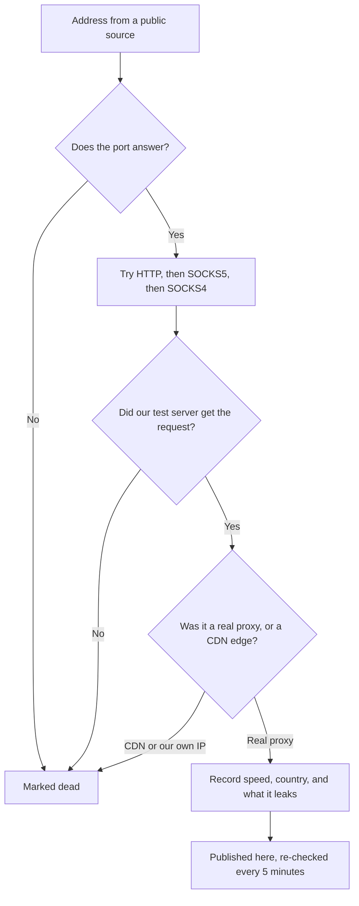

# Free Proxy List - Checked Every 5 Minutes


Most free proxy lists are full of dead addresses, and you only find out after your script
fails. This list is different. Every proxy here answered a real request through our own test
server in the last few minutes, and the files update every 5 minutes.

Right now you get **397 working proxies** in **51 countries**. Half of
them answer in under **942 ms**.

> Built and maintained by [Relayglass](https://relayglass.com).

## ⚡ Get your first proxy in ten seconds

Download the whole list:

```bash
curl -s https://raw.githubusercontent.com/relayglass/free-proxy-list/main/all.txt
```

Take the fastest one and use it right away. The files are sorted fastest first, so `head -1`
gives you the best proxy we have:

```bash
PROXY=$(curl -s https://raw.githubusercontent.com/relayglass/free-proxy-list/main/protocol/http/http.txt | head -1)
curl -x http://$PROXY https://example.com
```

In Python, with the `requests` library:

```python
import requests

proxies = requests.get("https://raw.githubusercontent.com/relayglass/free-proxy-list/main/protocol/http/http.txt").text.split()
r = requests.get("https://example.com", proxies={"http": f"http://{proxies[0]}"}, timeout=10)
print(r.status_code)
```

## Pick the right file for your job

| File | Proxies | Use it when |
| --- | ---: | --- |
| [`all.txt`](all.txt) | 397 | You want everything, `ip:port` on each line |
| [`all.csv`](all.csv) | 397 | You want to filter by country, speed, or uptime |
| [`all.json`](all.json) | 397 | Your code would rather not parse CSV |
| [`protocol/http/http.txt`](protocol/http/http.txt) | 179 | Your tool asks for an HTTP proxy. Start here |
| [`protocol/socks5/socks5.txt`](protocol/socks5/socks5.txt) | 124 | You need SOCKS5, which also carries non-web traffic |
| [`protocol/socks4/socks4.txt`](protocol/socks4/socks4.txt) | 94 | Your tool only speaks the older SOCKS4 |
| [`protocol/https/https.txt`](protocol/https/https.txt) | 140 | You need to load `https://` pages through the proxy |
| [`anonymity/elite/`](anonymity/elite) | 322 | The site must not see that you use a proxy |

A note on the HTTPS file. Many HTTP proxies can only forward plain `http://` pages. Loading an
`https://` page needs a different trick, called CONNECT, and only 140 of our proxies
support it. If your requests to secure sites fail, use that file.

## 📂 Browse by protocol, country, or anonymity

The files above are the whole list. If you already know what you need, take it straight from
one of these folders instead of filtering yourself. Every folder holds the same data in
`.txt`, `.csv` and `.json`.

```
protocol/
  http/     http.txt   http.csv   http.json
  https/    https.txt  https.csv  https.json
  socks4/   socks4.txt  ...
  socks5/   socks5.txt  ...

countries/
  US/       US.txt     US.csv     US.json
  DE/       DE.txt     DE.csv     DE.json
  ...one folder per country, 51 right now

anonymity/
  elite/        http/  https/  socks4/  socks5/
  anonymous/    http/  https/  socks4/  socks5/
  transparent/  http/  https/  socks4/  socks5/
```

So the elite SOCKS5 proxies, as JSON, are one request:

```bash
curl -s https://raw.githubusercontent.com/relayglass/free-proxy-list/main/anonymity/elite/socks5/socks5.json
```

And every German proxy, ready to paste into a tool:

```bash
curl -s https://raw.githubusercontent.com/relayglass/free-proxy-list/main/countries/DE/DE.txt
```

Country folders use the two-letter ISO code, upper case. A folder only exists while we have
at least one working proxy there, so the list of folders changes as the pool moves. Inside
`protocol/` and `anonymity/` the paths are fixed, and a file with nothing to report is
empty rather than missing - a script that reads an empty file keeps running, one that gets a
404 does not.

The `.json` files are a plain array, with no wrapper around it. `port`, `uptime_pct` and
`response_ms` are numbers and `https` is a boolean, so you can sort and filter without
converting anything:

```json
[
  {
    "ip": "159.195.49.27",
    "port": 8888,
    "protocol": "http",
    "https": true,
    "anonymity": "elite",
    "country_code": "DE",
    "country": "Germany",
    "response_ms": 7,
    "uptime_pct": 90.5,
    "checks": 273
  }
]
```

## 🌍 See where the proxies are

These are the five countries with the most working proxies right now:

```
United States  ██████████████████████████████  199
China          █████  34
Germany        ██  14
Japan          ██  13
France         ██  11
```

Country matters more than you might think. A proxy in the same country as the site you load
is usually faster, and some sites show different prices or content by country.

## Understand how we check every proxy

We do not copy other lists. We collect addresses from public sources, then test each one
ourselves against a server we run. Here is what every address goes through:



The first step saves most of the work. About seven in ten addresses on a public list are not
listening at all, and one connection attempt settles that in under 3 seconds.

The step most lists skip is the CDN check. Some addresses answer and look like a working
proxy, but they are really a content network edge, or they send the request from our own
address. Both would look like a success. We reject them, and that single check is the main
reason this list is short and honest instead of long and wrong.

## Read the anonymity level before you use a proxy

Every proxy sends headers (extra lines of information) with your request. Some of those lines
can contain your real IP address. We test what each proxy leaks and label it:

- `elite` — The site sees a normal request. It cannot tell that you used a proxy, and your
  real address is not in the headers. Use these when it matters.
- `anonymous` — The site can tell you used a proxy, but your real address is hidden. This is
  fine for most scraping.
- `transparent` — The proxy passes your real IP address in a header called
  `X-Forwarded-For`. It hides nothing. Avoid these unless you only want a different route.

The `anonymity` column in the CSV holds this value. If you use `all.txt` without checking it,
you may be using a `transparent` proxy and leaking your address.

## Filter the CSV to find exactly what you need

The CSV has one row per proxy and these columns:

```
ip,port,protocol,https,anonymity,country_code,country,city,org,asn,response_ms,connect_ms,uptime_pct,checks,last_checked,last_alive
```

- **`response_ms`:** How long a full request through the proxy took, in milliseconds. Under
  1,000 ms is fast. Over 3,000 ms is slow.
- **`uptime_pct`:** The share of our checks that found this proxy working, from 0 to 100. The
  most useful column in the file.
- **`checks`:** How many times we have tested it. A 100% score from 3 checks means much less
  than 85% from 400 checks.
- **`last_alive`:** The last time it actually worked, in UTC.

Get every German proxy:

```bash
curl -s https://raw.githubusercontent.com/relayglass/free-proxy-list/main/all.csv | awk -F, '$6=="DE" {print $1":"$2}'
```

**A trap to avoid here.** The `org` column holds company names, and some of them contain a
comma, like `Google LLC, US`. That name is in quotes, but `awk -F,` does not know about
quotes, so it splits inside the name and shifts every column after it. Columns 1 to 8 are
always safe to read this way. For anything after `org` - including `uptime_pct`, the column
you most want - use a real CSV reader:

```python
import csv, io, requests

text = requests.get("https://raw.githubusercontent.com/relayglass/free-proxy-list/main/all.csv").text
rows = csv.DictReader(io.StringIO(text))

fast = [f"{r['ip']}:{r['port']}" for r in rows
        if r["country_code"] == "DE" and float(r["uptime_pct"]) >= 80]

print(len(fast), fast[:5])
```

## Know how long a free proxy lives

Free proxies are not stable, and any list that promises uptime is lying to you. Here are our
real numbers, measured across the whole list.

The average proxy in this list has **91.4% uptime**. So if you load 100
addresses from `all.txt` and try them all at once, expect about **91** to answer.
The rest will have died since the last check, and that is normal.

We re-test every working proxy every 5 minutes. If one fails, we test it less often, and
after 42 hours of continuous failure we drop it completely. That is why the list stays short.
A list of 200,000 proxies is a list nobody checked.

## ⚠️ Three warnings worth reading

**The operator sees everything you send.** A public proxy is somebody else's server, and that
somebody can read every plain request that passes through. Never sign in to an account
through a free proxy. Never send a password, a card number, or a private file. Treat every
response you get back as untrusted too, because it can be changed on the way.

**Do not hammer one proxy.** Most of these are misconfigured servers whose owner does not
know they are open. Send a few requests, then move to the next address. If you push hundreds
of requests per second through one proxy, you take down a stranger's server.

**Free proxies are not for anything that must work.** They fail without warning, they change
country, and they get blocked by big sites. If your business depends on the request landing,
free proxies are the wrong tool. That is honest advice even though we sell the other kind.

## 💡 Bonus tips most lists will not tell you

- **Sort by uptime, not by speed.** A proxy at 300 ms with 20% uptime wastes more of your
  time than one at 1,200 ms with 90% uptime. Use the `uptime_pct` column.
- **Always set a timeout.** Give each request 10 seconds at most. Without a timeout, one dead
  proxy can hang your script for minutes.
- **Retry with the next proxy, not the same one.** If an address fails twice, it is gone.
  Move on rather than retrying it.
- **Cache this file, do not fetch it per request.** It only changes every 5 minutes, so
  download it once and reuse it.

## When you need proxies that stay up

This list is a free tool we run because it is useful, and because it shows how we test. When
you need proxies that keep working, [Relayglass](https://relayglass.com) sells residential,
mobile, and datacenter proxies with real support behind them. You can see live prices and the
country list at [relayglass.com/pricing](https://relayglass.com/pricing).

You can also use the filterable version of this list, with search and sorting, at
[https://relayglass.com/tools/free-proxy-list](https://relayglass.com/tools/free-proxy-list).

More free tools, including a bulk proxy checker and an IP checker, are at
[relayglass.com/tools](https://relayglass.com/tools).

## In short

You get 397 working proxies, updated every 5 minutes. Check the `anonymity` column
before you trust a proxy to hide your address, sort by `uptime_pct` rather than speed, and
never send anything private through a free proxy.

**Last updated:** 2026-08-28 14:10 UTC. This page and every file are generated
automatically, so a pull request against them will be replaced by the next run.

## ⚖️ Disclaimer

These proxies are run by third parties we do not control. The list is provided as is, with no
warranty of any kind. Relayglass accepts no liability for any loss or damage arising from
your use of it, and you are responsible for using it lawfully.

Free to use for anything, with no attribution required. Questions go to
[contact@relayglass.com](mailto:contact@relayglass.com).